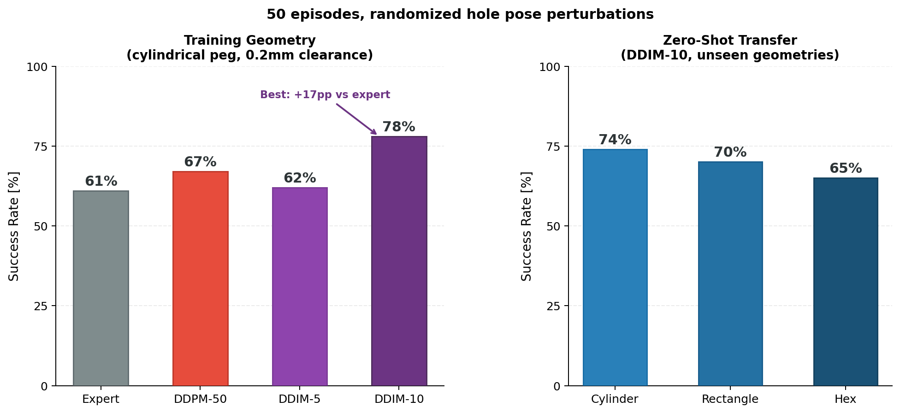

# force-insertion-sim

MuJoCo simulation environment for tight-clearance peg-in-hole insertion. Built on [SimCore](https://github.com/AlexanderWegenerRobotics/SimCore) for simulation and control infrastructure.

Implements a multi-phase expert policy for data collection and closed-loop policy deployment, targeting sub-millimeter clearance insertion with a Franka Panda arm.

---

## Demo

| Wide View | Close-Up |
|:---------:|:--------:|
|  |  |

---

## Results

Closed-loop evaluation over 50 episodes with randomized hole pose perturbations. The learned DDIM-10 diffusion policy (trained in [force-insertion-policy](https://github.com/AlexanderWegenerRobotics/force-insertion-policy)) outperforms the deterministic expert by 17 percentage points.



The policy transfers zero-shot to unseen peg geometries (rectangle, hexagon) without retraining, achieving 65–74% success across all tested shapes.

---

## Overview

The robot executes a four-phase insertion sequence using Cartesian impedance control with feed-forward Lissajous force profiles:

```
APPROACH → CONTACT → SEARCH → INSERT → DONE
                                      ↘ FAILED (timeout)
```

Each episode independently perturbs the hole pose and approach setpoint, producing diverse demonstrations across varying alignment conditions. Data is recorded at 200 Hz into HDF5 files for downstream policy training.

---

## Repository Structure

```
force-insertion-sim/
├── configs/
│   ├── global_config.yaml          ← entry point: paths + trial name
│   ├── scene_config.yaml           ← SimCore scene: robot, hole, cameras
│   ├── task_config.yaml            ← episode parameters, wiggle profile, data output
│   └── control/
│       └── panda_arm.yaml          ← controller gains
├── src/
│   ├── main.py                     ← entry point
│   ├── task/
│   │   ├── insertion_task.py       ← outer loop: N episodes, pose sampling
│   │   ├── insertion_episode.py    ← state machine: APPROACH → CONTACT → SEARCH → INSERT
│   │   └── trajectory.py          ← minimum-jerk Cartesian trajectory planner
│   ├── data/
│   │   └── episode_data_collector.py  ← HDF5 writer + dataset index
│   └── utils/
│       └── sensor_callback.py      ← FT sensor readout with gravity compensation
├── models/
│   ├── mujoco/
│   │   ├── franka_fr3/             ← FR3 arm with peg attachment
│   │   └── props/holes/            ← hole fixture meshes
│   └── urdf/                       ← URDF for Pinocchio kinematics
├── docs/
│   ├── gifs/                       ← demo clips
│   └── plots/                      ← result figures
└── tests/
    ├── data_sanity_check.ipynb
    └── read_obs.ipynb
```

---

## Installation

```bash
# 1. Install SimCore
git clone https://github.com/AlexanderWegenerRobotics/SimCore.git
cd SimCore && pip install -e . && cd ..

# 2. Install this repo
git clone https://github.com/AlexanderWegenerRobotics/force-insertion-sim.git
cd force-insertion-sim
pip install -r requirements.txt
```

---

## Running

### Data Collection

```bash
cd src
python main.py
```

Configure episode count, hole geometry, and output path in `configs/task_config.yaml`. Set `headless: True` in `configs/scene_config.yaml` for fast collection without rendering.

### Deploying a Trained Policy

```bash
cd src
python main.py --policy ../checkpoints/ddim10_early_fusion.onnx
```

The policy receives the 18-dimensional observation vector (external wrench, internal wrench, end-effector velocity) and outputs a 6D feed-forward force command passed through the frequency alignment filter to the impedance controller.

---

## Data Format

Each episode is saved as `obs/episode_XXXX/episode.h5`. A `dataset_index.yaml` indexes all episodes with success, duration, and hole pose metadata.

| Group | Signal | Shape | Description |
|-------|--------|-------|-------------|
| `obs` | `f_ext` | `(T, 3)` | External force at EE [N], gravity-compensated |
| `obs` | `f_internal` | `(T, 6)` | Internal wrench from joint torques [N, Nm] |
| `obs` | `ee_velocity` | `(T, 6)` | EE linear + angular velocity [m/s, rad/s] |
| `action` | `Fff` | `(T, 6)` | Feed-forward force command [N, Nm] |
| `meta` | `success` | scalar | Episode outcome |
| `meta` | `hole_pos` | `(3,)` | Sampled hole position [m] |

```python
from data.episode_data_collector import EpisodeDataCollector

index = EpisodeDataCollector.load_index("obs/")
successful = [e for e in index if e["success"]]
ep = EpisodeDataCollector.load_episode(f"obs/{successful[0]['path']}")
f_ext = ep["obs"]["f_ext"]   # (T, 3)
Fff   = ep["action"]["Fff"]  # (T, 6)
```

---

## Reference

Expert policy adapted from:
> Wu et al., *1 kHz Behavior Tree for Self-adaptable Tactile Insertion*, ICRA 2024.
> DOI: [10.1109/ICRA57147.2024.10610835](https://doi.org/10.1109/ICRA57147.2024.10610835)